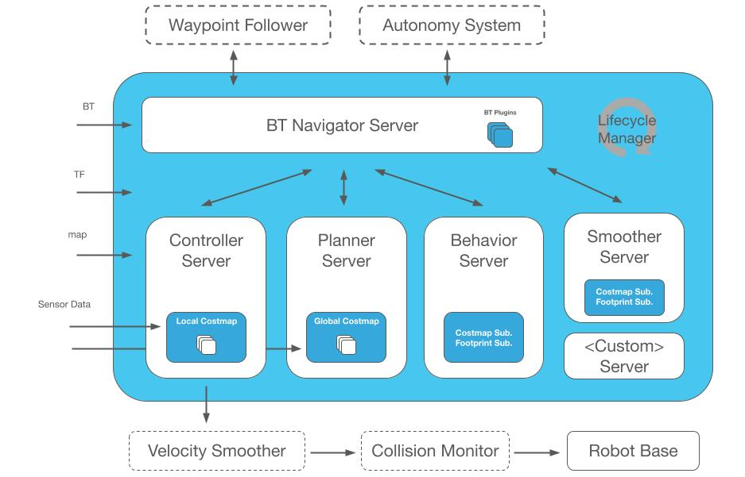
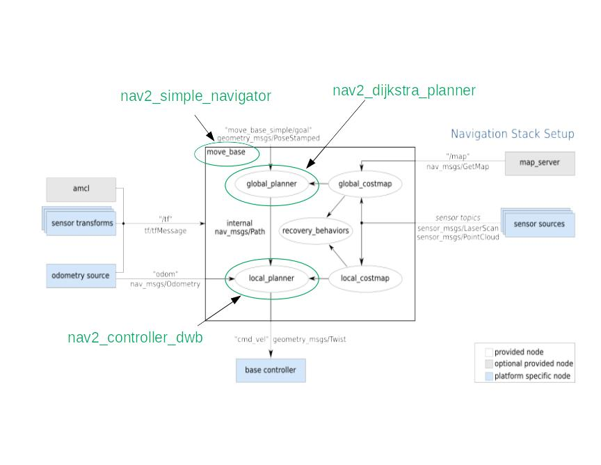
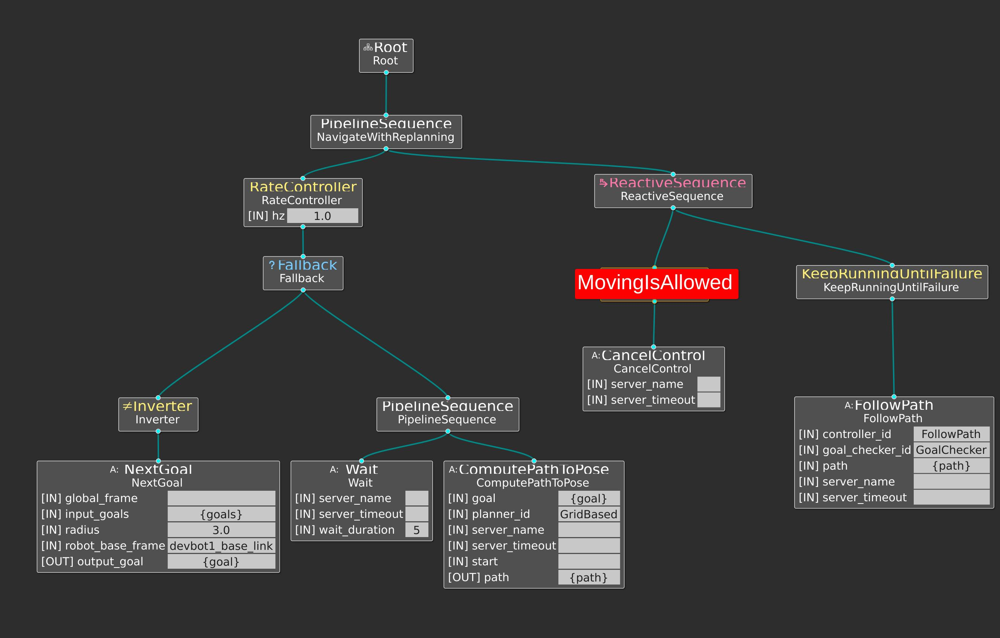
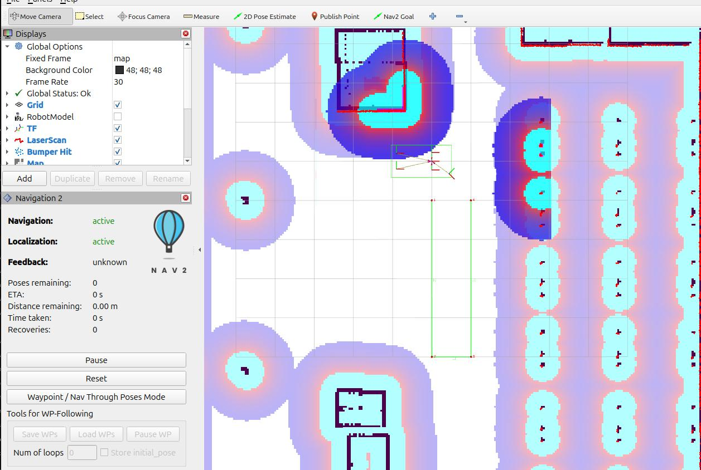

# 🤖 ROS2 Navigation2 Learning

## 📖 Overview
This repository contains my learning notes, documentation, and resources for the ROS2 Navigation Stack (Nav2).

## 📌 Topics Covered
- ROS2 Navigation2
- SLAM
- AMCL Localization
- Global & Local Path Planning
- Behavior Trees
- Costmaps
- Obstacle Avoidance
- RViz2 Navigation

## 🖼️ Architecture

## 🗺️ Navigation Stack

## 🌳 Behavior Tree

## 🚀 RViz Navigation Demo

## 🛠️ Tools
- ROS2
- Navigation2 (Nav2)
- RViz2
- Gazebo
- Ubuntu Linux

## 📚 References
- https://github.com/ros-navigation/navigation2
- https://navigation.ros.org/

## 👨‍💻 Author
**Abhilash Pendyala**
